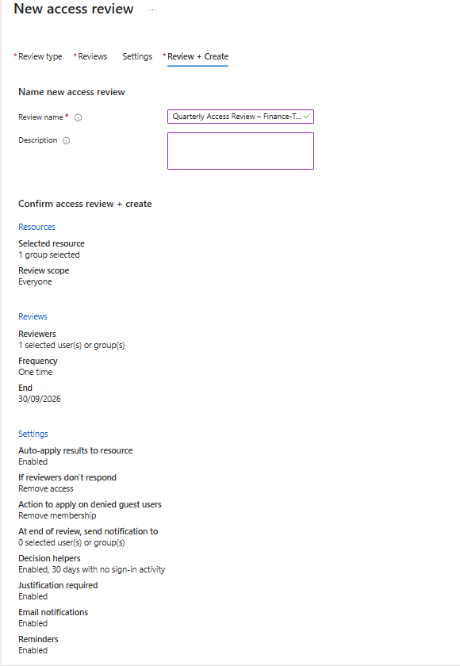
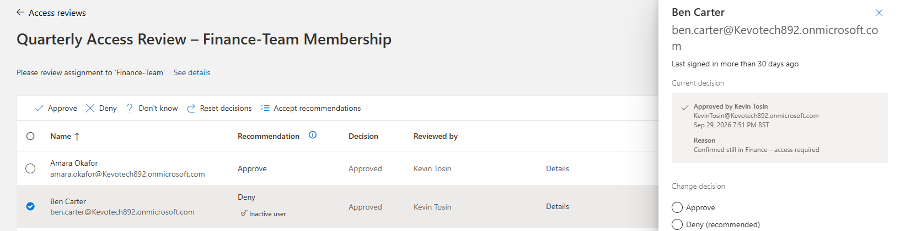
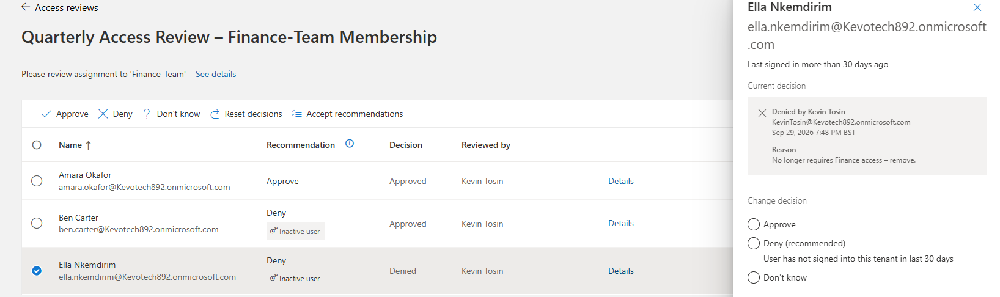
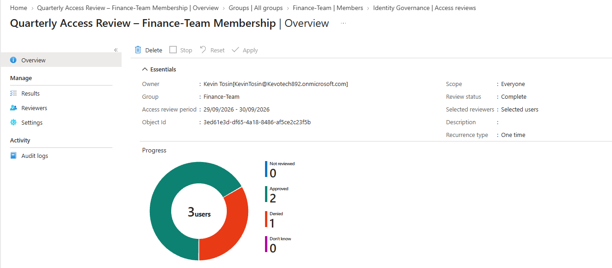
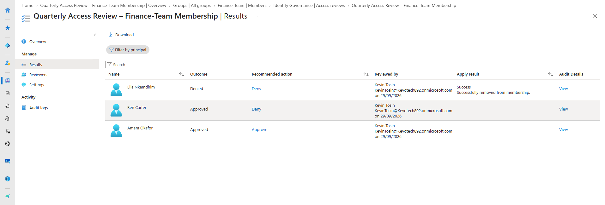
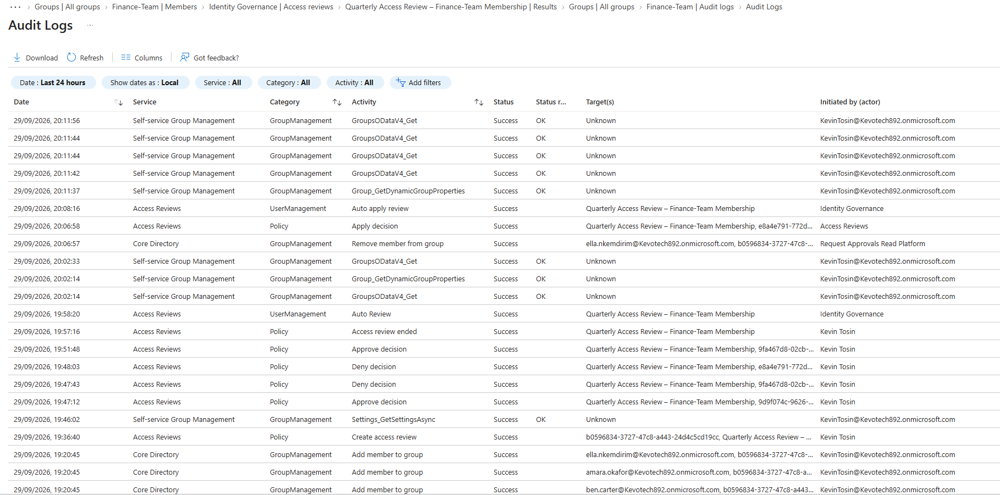

# Access Reviews in Microsoft Entra ID

**Platform:** Microsoft Entra ID (P2) · Identity Governance · Access Reviews
**Domain:** Identity & Access Management · Access certification · Zero Trust
**Approach:** Periodic recertification of access — reviewer decisions, decision helpers, auto-remediation, and full audit

---

## The problem — a real-world attack, not a hypothetical

In **July 2020, Twitter** was hacked by a group of attackers — some of them teenagers — who took control of **130 high-profile accounts** (Barack Obama, Joe Biden, Elon Musk, Apple and others) and ran a Bitcoin scam from them. They got in by social-engineering Twitter employees over the phone. But the reason a few phished employees turned into a total account-takeover was what those employees could *reach*: Twitter had given **over a thousand employees and contractors standing access to powerful internal administrative tools** — far more people than actually needed it. The New York State Department of Financial Services investigation singled this out directly: access to sensitive tooling was **too broad and was not restricted to those whose jobs required it**. [1][2]

The password wasn't the root cause — the **standing, un-reviewed access** was. Access is granted for a reason, but reasons expire: people change teams, projects end, a one-off task is done. If nobody ever goes back and asks *"does this person still need this?"*, access only ever accumulates. Every unnecessary account with access to a sensitive system is extra blast radius waiting for one phished login. This slow pile-up of access — **privilege creep** — is one of the most common and least visible risks in any organisation, and it is exactly what Access Reviews exists to control.

## What this project is — and the skills it proves

This project builds and proves the control that pushes back against that accumulation: **Access Reviews** in Microsoft Entra ID. On a schedule, the right person is forced to look at each member of a group (or holder of a role) and make an explicit **keep-or-remove** decision. Anything not positively recertified is **removed automatically**. Access stops being "granted once and forgotten" and becomes something that must be **re-justified to survive**.

It demonstrates the identity-governance skills to run access certification end-to-end — the recertification discipline that ISO 27001, SOC 2 and SOX all require, and the operational answer to Zero Trust's "least privilege" pillar over time.

| What happened at Twitter | What Access Reviews changes |
|---|---|
| Far more people had access than needed it | Periodic review forces each member to be **re-justified or removed** |
| Access was granted once and never revisited | Reviews run on a **recurring schedule** — access is continuously recertified |
| Nobody owned the "do they still need this?" question | A named **reviewer** must make an explicit keep/remove decision on every user |
| Unneeded access simply persisted | Denied access is **auto-removed** — no manual cleanup to forget |

The rest of this document shows the build: a live review of a group's membership, a reviewer decision with justification, and the automatic removal of the user who no longer needed access.

---

## The concept — access certification

Every other control in this portfolio governs access at the moment it's granted or used. Access Reviews governs it **over time**. The model is simple:

- Access is not permanent. It has to be **periodically re-confirmed** by someone accountable — a manager, a group owner, or a governance reviewer.
- The default is **deny**. If access isn't positively recertified, it's removed — not left standing.
- The decision is **logged with a justification**, so there's an audit trail proving *who* confirmed *what* and *why*.

In one line: **Access Reviews is the recurring "does this person still need this?" control — the recertification that catches the standing access that JML and PIM don't.**

---

## Build & proof

### 1. The review configuration

An access review is created against the **Finance-Team** group. The settings are what make it a real control, not a rubber stamp: **auto-apply results** (denied users are actually removed), a **fail-secure default** (*if reviewers don't respond → remove access*), a **decision helper** flagging anyone with no sign-in in 30 days, and **justification required** on every decision.

Key design point: **"if reviewers don't respond, remove access."** The system defaults to *deny*, not *keep* — access that isn't explicitly recertified is stripped, not grandfathered in.

### 2. Recommendations vs. judgement — the human decides

The reviewer sees every Finance-Team member alongside a **recommendation** from the decision helper — *Approve* for the active user, *Deny* for the two flagged as inactive (no sign-in in 30 days). Here the reviewer **approves Ben despite the "Deny (recommended)" flag**, because he's confirmed as still in Finance. The machine recommends; the human decides. That override is the whole point of a review — judgement, not automation.

### 3. Removing stale access — a deny with justification

The member who no longer belongs to Finance is **denied**, with a written justification — *"No longer requires Finance access – remove."* That reason becomes the audit record, and the denial is what triggers the automatic removal.

### 4. Review completed

The review completes with its outcomes recorded: **2 approved, 1 denied**, every decision attributed to the reviewer.

### 5. Automatic remediation — the whole point made visible

Because auto-apply was enabled, the denied user is **removed from the group automatically** — no manual cleanup, nothing to forget. The result column proves it: *"Success. Successfully removed from membership."* The two approved users are untouched.

This is the difference between a review that produces a *report* and one that produces an *outcome*. The access didn't just get flagged — it got revoked.

### 6. Full audit trail

Every decision, justification, reviewer identity, and the removal action is written to the audit log — the evidence an ISO 27001 or SOX access-certification audit asks for on demand.

---

## Key design decisions

- **Default to deny.** *If reviewers don't respond → remove access.* Access that isn't positively recertified is stripped, not kept. This is the fail-secure posture that makes a review a control rather than a formality.
- **Auto-apply, not a report.** Enabling auto-apply means denied access is actually removed. A review that only produces a spreadsheet nobody actions is theatre.
- **Human decides, machine assists.** The decision helper flags dormant accounts, but the reviewer makes the call — proven here by overriding a "remove" recommendation for a user confirmed as still needed.
- **Justification required.** Every decision carries a written reason, producing an audit trail that ties directly to compliance evidence.
- **Recurring by design.** Configured one-time here for demonstration; in production this runs on a **quarterly recurrence** so access is recertified continuously, not once.

---

## Future improvements

- **Route to managers or group owners** rather than a central reviewer, so the person with real context makes the call (requires manager attributes / owned groups populated, as an HR feed would in production).
- **Review privileged roles**, not just groups — recertify who is eligible for admin roles in PIM, closing the loop with the Privileged Identity Management project.
- **Access packages + entitlement management** — bundle access into packages with built-in review cycles, for scalable, self-service-plus-governance access.
- **Governance reporting** — export review outcomes and feed removals into Microsoft Sentinel, so certification activity becomes SOC-visible telemetry.

---

## Skills demonstrated

· Access certification / recertification design
· Microsoft Entra Identity Governance (Access Reviews)
· Reviewer workflow and decision-helper configuration
· Auto-remediation of unapproved access
· Fail-secure ("default deny") governance design
· Least-privilege enforcement over time (privilege-creep control)
· Access-governance auditing for compliance (ISO 27001 / SOC 2 / SOX)
· Mapping controls to a real-world breach

---

## References

1. New York State Department of Financial Services — [Twitter Investigation Report](https://www.dfs.ny.gov/reports-and-publications/other-reports/Twitter_Report) (October 2020) — finding that access to internal tools was too broad and not restricted to those who needed it.
2. NY DFS — [Department of Financial Services Calls for Regulation of Social Media Giants After Twitter Hack Investigation](https://www.dfs.ny.gov/reports_and_publications/press_releases/pr202010141) (press release, 14 October 2020).
